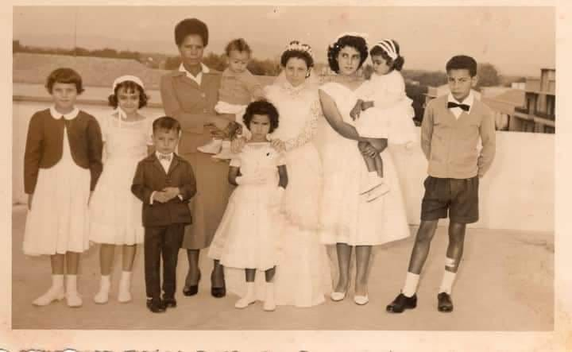
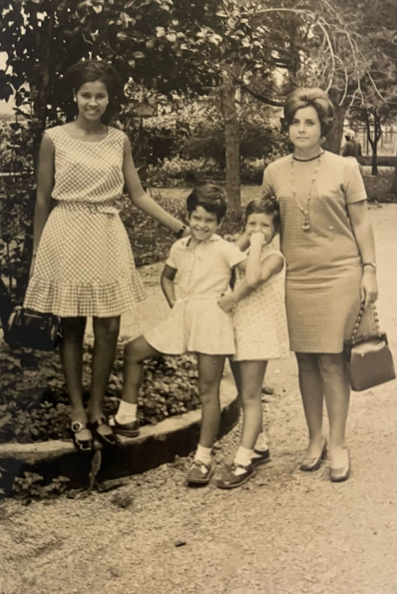
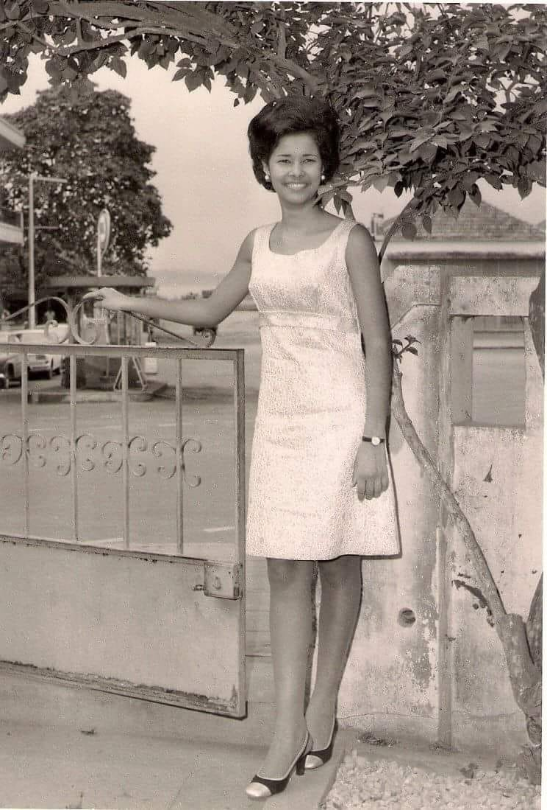
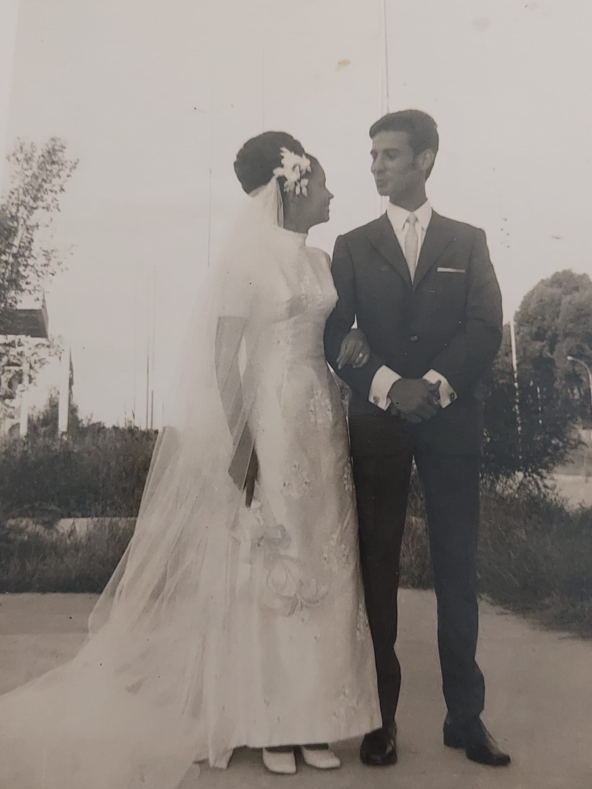
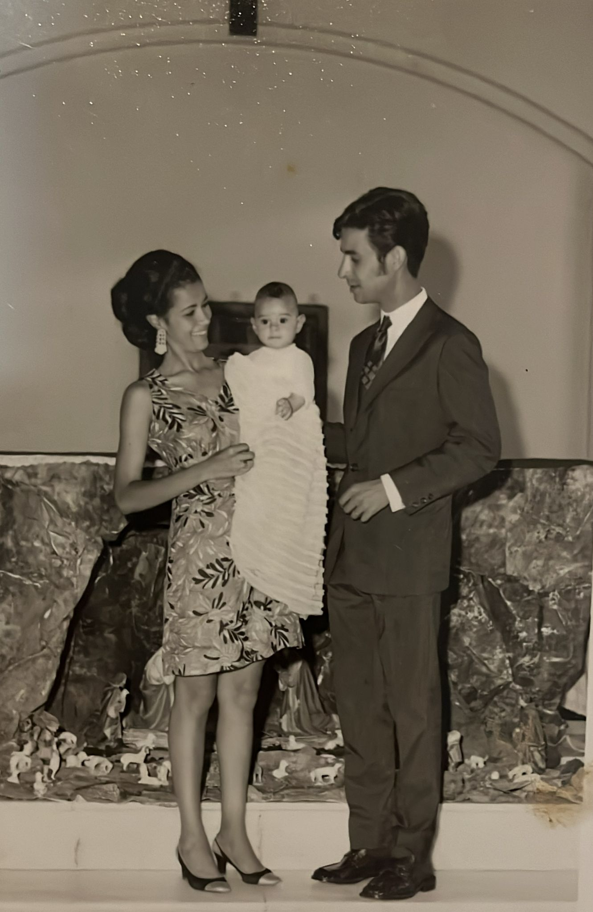
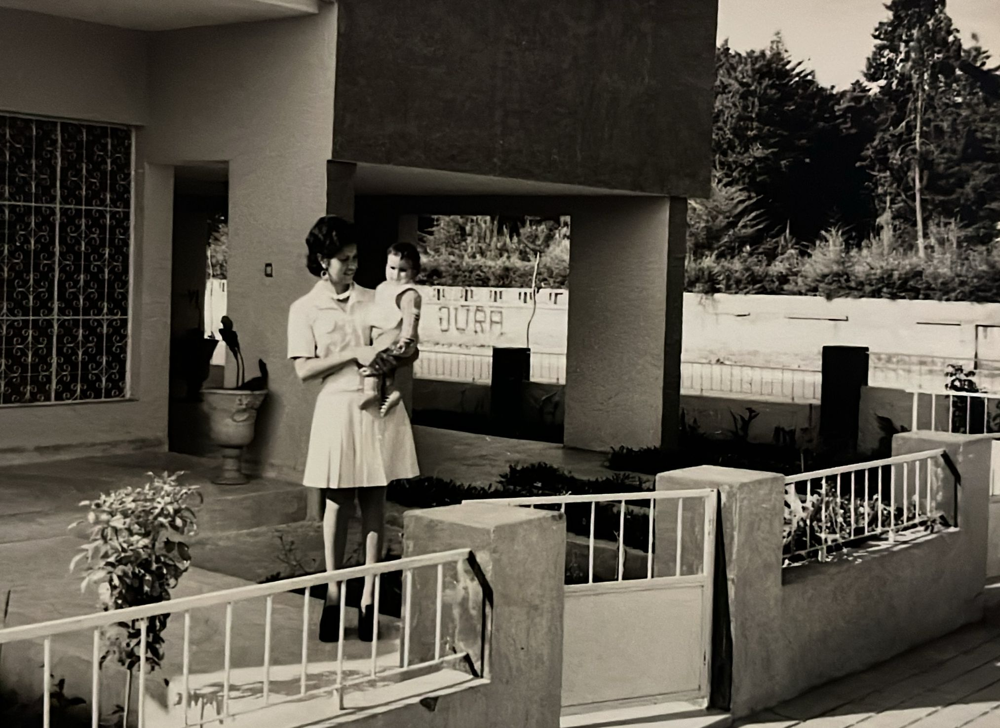
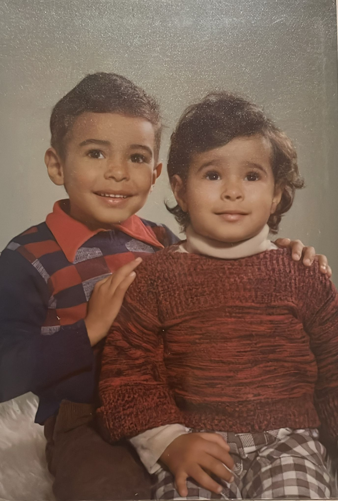

# Entrevista Definitiva para o Trabalho de Análise e Visualização de Dados
---

**Título:** Entrevista à minha avó para o Trabalho Final de Análise e Visualisação de Dados

**Contextualização:** Esta entrevista foi realizada no âmbito da UC de Análise e Visualização de Dados, sendo o seu objetivo o processamento do seu conteúdo à luz do processamento de linguagem natural e a criação de um baú de família.

**Data:** 02/04/2025

**Entrevistador:** João Garção

**Entrevistada:** Rosa Reis

---
## Corpo da Entrevista
**João:** Boa tarde. Estou aqui hoje para entrevistar a minha avó. Irei então fazer-lhe uma série de perguntas às quais ela vai responder e procurarei ser o mais objetivo possível com ela para que as respostas possam ser fluídas. Sendo assim, boa tarde, hoje irei colocar-te uma série de perguntas. O objetivo é isto ser uma conversa assim mais informal e estou à espera que consigas responder a tudo ou a praticamente tudo o que eu irei perguntar. Então, o que é que tens a dizer da tua infância, de que é que te lembras mais, o que é que te fez mais feliz e o que é que era diferente que hoje não é assim tão igual?

**Rosa Reis:** Como deves calcular, eu já nasci há 73 anos e nessa época a vida era completamente diferente do que é agora. Lembro-me de uma infância muito feliz, tive uma avó que me deu muito carinho, que me deu muito amor. Tenho... tinha duas irmãs, porque a mais velja já morreu, mas eu nasci porque elas pediram que eu nascesse e então eu acabei por ser uma menina do mimo, porque era mimada pela mãe, pelos irmãos, pelo pai e até pelos vizinhos. Vivíamos em Angola, em Angola nós tínhamos uma vida muito mais livre do que aqui em Portugal, e penso que em Portugal, eu até comparo um bocadinho à vida das aldeias, embora morássemos numa cidade em que tínhamos liberdade para sair de casa, andarmos descalços, subir às árvores, brincar... Havia uma empatia muito grande com os vizinhos, que deixavam de ser vizinhos para ser praticamente nossos familiares. Foi uma infância que guardo com bastante saudade e em que fui feliz. Entretanto, as coisas foram evoluindo, acabámos, mais tarde, os estudos, comecei a trabalhar na banca, casei. Desse casamento nasceram dois filhos que são os amores da minha vida e que por eles tudo faço e tudo faria e agora que me deram os 3 netos que tenho, que são a luz da minha vida. Sou feliz por isso, são miúdos que acabaram por corresponder aos objetivos que eu pretendia na minha vida no que respeita à sua educação. São pessoas realmente de que me orgulho, porque nunca me deram desgostos, sempre foram muito bem comportados, de bom caráter, boa índole, muito meus amigos e não poderia desejar mais do que isto na minha vida.

**João:** Nasceste em que ano? Foi em 1952, não foi?

**Rosa Reis:** Em 1951, eu nasci em 1951. 

**João:** Ah, em 1951.

**Rosa Reis:** Eu vivi na cidade de Benguela, em Angola, até aos meus 14 anos, depois fui para o Lobito, que é uma cidade que fica a 20km de Benguela. Entretanto vim a Portugal passar férias com o meu pai e com a família. Conheci outros familiares, que são da região do Douro, que é a origem do meu pai, o meu pai nasceu no Douro, a minha avó também e duas irmãs. Entretanto, eu já nasci em Angola, eu e mais dois irmãos. Somos irmãos bastante unidos, que nos apoiamos, nunca houve grandes problemas entre nós e tivemos uma vida bastante tranquila. Quando vim de Portugal, fui para uma cidade, que é a cidade mais ao Norte de Angola, que é a cidade de Cabinda. Na época, foi quando começou a prospeção de petróleo pelos EUA, do que resultou uma evolução muito grande da cidade e quando começaram a ir para lá muitas pessoas que eram contratadas pela *Cabinda Golf* precisamente para fazerem a exploração de petróleo. Inicialmente trabalhei numa companhia americana, que era a *Marine Service*, uma empresa que se destinava a tratar da logística das sondas que estavam no mar. Um ano depois, candidatei-me à banca e ingressei no banco, portanto fiquei ligada à banca até à minha reforma. Em Angola trabalhei no *Banco de Crédito* e no *Banco Totta Standard*. Depois vim para Portugal, após o 25 de abril, e ingressei no *Banco Santander*, aliás no *Banco Totta & Açores*, que hoje é o *Banco Santander*. Fiz uma boa carreira, gostei do trabalho que fiz, criei muitos amigos, conheci muita gente, e ao fim e ao cabo esse é o percurso da minha vida.
**João:** Cabinda na altura era grande ou era uma cidade pequena?

**Rosa Reis:** A cidade em si era uma cidade pequena em que toda a gente se conhecia. As pessoas viviam com muita facilidade, porque a vida era muito barata, e depois era uma cidade rica. As pessoas foram-se conhecendo, muito solidárias, muitas festas, tinha umas praias espetaculares. Agora, a sua floresta, a segunda maior do mundo, era qualquer coisa de imponente. Eu nunca consegui entrar nela mas já li muito sobre ela. Realmente foi uma das cidades onde gostei muito de viver. Tínhamos uma vida muito fácil, não sabíamos o que eram dificuldades. A maior parte da população, mesmo a mais pobre não lhe faltava o indispensável, viviam relativamente bem, não havia pessoas pobres.

**João:** Na altura, qual é que era a moeda lá?

**Rosa Reis:** Lá era o escudo.

**João:** Era como aqui, então?

**Rosa Reis:** Não, era o escudo angolano.

**João:** E na altura devia ter mais valor, não?

**Rosa Reis:** Não, tinha menos valor que o de Portugal, e havia alguma dificuldade em transferir dinheiro de lá para cá. Tinha que haver uma justificação. Tinha que se justificar a transferência. Não sei qual era. O que é que exigiu na altura, porque nós, as pessoas que foram de Portugal para Angola, queria aquilo. Era um estilo de vida que dificilmente se poderá contar. Tem que ser vivido. Nunca pensavam em regressar a Portugal. Deparei me com muita gente que vinha passar um mês a Portugal e passado 15 dias regressava porque eles não se adaptavam já à vida em Portugal e regressavam a Angola. Angola tem um clima extraordinário, é uma terra muito rica. Pena é que penso que as coisas lá não estejam a correr muito bem. O povo neste momento vive com muitas dificuldades e isto já entra no âmbito da política e eu aí não me quero pronunciar, porque não estou devidamente informada para para falar sobre isso. Mas pronto, já estive lá depois da independência, pois tenho lá uma filha a trabalhar, é professora na escola portuguesa e, claro, atendendo à situação da minha família, que é uma situação boa financeiramente, foram férias formidáveis que nós lá passámos, não é? Mas pronto, em Portugal fui bem recebida, contrariamente a muita gente e com certamente com justificadas razões, se queixam da maneira como foram recebidas. Eu, pessoalmente, por onde andei, fui sempre bem recebida. Fiz boas amizades. Sempre fui muito apoiada. Não tenho qualquer razão de queixa.

**João:** Lá em Cabinda, as pessoas que moravam lá e trabalhavam, a maior parte cresceu lá em Angola ou são pessoas que foram de Portugal para lá e ficaram lá? 

**Rosa Reis:** Tinha pessoas de toda a parte do mundo porque vinha atendendo à exploração, ao petróleo.

**João:** E até muitos americanos.

**Rosa Reis:** Muitos americanos, sul africanos, portugueses, espanhóis, libaneses. Havia gente de todas as nacionalidades, praticamente. Muita gente mesmo.

**João:** E depois, quando saíram de lá, foram para onde? Para que sítio?

**Rosa Reis:** Eu, quando saí de lá, saí e voltei novamente para o Lobito, porque eu conheci o teu avô em Cabinda. O teu avô estava lá a fazer o serviço militar. Entretanto resolvemos casar e eu regressei. Saí de Cabinda e foi quando eu fui para Silva Porto, que hoje é o Cuito, que foi onde me casei. Casei-me, fui para lá de onde vivia e fiquei lá a viver e a trabalhar na banca na mesma até regressar. E foi lá que nasceram os meus dois filhos.

**João:** Tarabalhaste na banca quantos anos, ao fim e ao cabo, tudo somado?

**Rosa Reis:** Em Angola, trabalhei seis anos. Eu entrei para a banca, penso que foi, seis anos no banco em Angola. Entrei em janeiro de 1969.

**João:** Então, saíste em 1975? Pois.

**Rosa Reis:** E depois foi aqui. Aqui em Portugal fui reintegrada em Maio de 77. Exactamente. De qualquer forma, o que eu te queria também contar é o seguinte: eu quando saí de Cabinda, eu saí Cabinda em Dezembro, só casei em Abril e então tive que pedir a transferência para o Lobito, que era onde vivia a tia, uma irmã minha, e porque eu fui para lá viver para a casa dessa minha irmã e fui para o mesmo banco. Entretanto, na expectativa porque me tinham dito que iriam abrir uma um.

**João:** Balcão.

**Rosa Reis:** Um balcão em Silva Porto. Casei, pedi uma licença sem vencimento, depois casei e voltei para o Lobito. Isto, foi em abril. Esperei até dezembro, em dezembro o banco ainda não tinha aberto nenhum balcão lá. Resolvi despedir-me porque não fazia sentido eu estar estar a viver no Lobito, estando casada e o marido a viver em Silva Porto. Portanto, despedi-me do banco em dezembro e reingressei no *Banco Totta Standard* em Janeiro de 1972. Quando entrei eu já tinha uma carreira feita no *Banco de Crédito*. Entrei no *Banco Totta Standard*. Disseram me que tinha que entrar outra vez como iniciante -não é? - no escalão mais baixo. Em 3 anos consegui subir e quando vim já era procuradora do banco em em Silva Porto, e em Portugal aconteceu a mesma coisa: Vim para o Porto, fui colocada no balcão das Antas. Entretanto fui convidada, como sabiam que os meus filhos estavam em Guimarães e eu tinha pedido a transferência para Guimarães e na altura as viagens para o Porto ainda não havia autoestradas. Nós tínhamos, eu diria que tinha que fazer de autocarro e levavam duas horas, obrigou me a que eu tivesse que alugar uma casa, um quarto de um lar de estudantes no Porto, onde ia à segunda à sexta feira e regressava. Durante a semana, a minha sogra, que é a tua avó, ficava convosco. Vocês eram pequeninos. Tu tinhas três anos e a tua irmã tinha.

**João:** Não, eu não. O meu tio.

**Rosa Reis:** O teu tio tinha três anos e a tua mãe tinha um ano. Entretanto, em abril foi criado um gabinete da direcção do banco aqui em Guimarães e eu fui convidada para o secretariado. Portanto, vim para aqui como secretária. Mais tarde, fui para o balcão trabalhar e acabei a minha carreira como gerente do banco. É um balcão muito grande, em que a equipa da gerência era composta por cinco pessoas: o primeiro gerente, depois havia um segundo gerente de crédito e um subgerente de crédito. E eu era a segunda gerente da área de aplicações financeiras - Atendimento ao balcão.

**João:** A forma de trabalhar da banca, era igual aqui ou em Angola era diferente?

**Rosa Reis:** A maneira de trabalhar era diferente. Agora, as coisas evoluíram muito. Eu quando entrei para a banca, em 1969, ainda não havia computadores. O primeiro computador com que trabalhei era um *NCR*, que tinha para aí um metro de largura. E era aí que nós começámos a trabalhar, porque eu ainda sou do tempo em que para fazer lançar os movimentos dos clientes eram lançados à mão com uma máquina de calcular.

**João:** Como é que? Como é que isto era feito?

**Rosa Reis:** Nós tínhamos uma ficha de cada cliente e quando o cliente vinha lá, por exemplo, para levantar um cheque, nós tínhamos que, à mão, escrever a data, pôr o número do cheque, o valor e abater e o valor do levantamento. E o mesmo acontecia com os depósitos, não é?

**João:** Então e depois? Como é que fizeram essa adaptação, na altura mais digital. Tinham que passar isso tudo para computadores, não foi?

**Rosa Reis:** Exactamente. Nessa altura foi um técnico passar com o nosso apoio e então começámos a trabalhar com o computador, facilitando assim o serviço.

**João:** Isso demorou muito tempo na altura? Deu muito trabalho, muitos problemas?

**Rosa Reis:** Não, na altura as pessoas adaptaram-se com relativa facilidade. Depois veio a *Nixdorf* e por aí adiante.

**João:** O que é que era a Nixdorf?

**Rosa Reis:** Era um tipo de computador diferente, mais pequeno. Estás a ver as televisões antigamente, como eram umas caixas grandes? Eles tinham aquela configuração mais ou menos dessas televisões.

**João:** Antigamente, os bancos também deviam estar cheios de papéis, dos extratos de muitos papéis.

**Rosa Reis:** Muito, muito, muito trabalho administrativo. Nada estava digitalizado, pois o sistema informático ainda estava muito...

**João:** Não estava evoluído.

**Rosa Reis:** Não estava evoluído, razão pela qual hoje vais à banca e num balcão encontras para aí 12 ou 13 funcionários. Por exemplo, aqui em Guimarães, na altura em que vim para Guimarães, éramos 36 empregados. Hoje,  estamos reduzidos, estão reduzidos. Eu acho que para aí há 12 ou 13. Não faço ideia. Mas uma coisa assim muito, muito pequena.

**João:** E o que é que as pessoas procuravam nos bancos antigamente?

**Rosa Reis:** Fundamentalmente, depositavam as suas economias, pagavam... Esta zona aqui de Guimarães é uma zona muito industrializada, portanto nós estávamos ligados às empresas. Chegávamos ao fim do mês, os pagamentos de ordenados eram feitos através do banco, portanto o fim do mês era sempre muito movimentado porque não havia caixas multibanco e os clientes tinham que ir ao balcão levantar o dinheiro.

**João:** Devia ser muito tempo. Quanto é que uma pessoa demoraria na fila assim, em média?

**Rosa Reis:** Tudo isto sem exageros. Ora, nós tínhamos filas aí, sei lá, de de para aí de 20m.

**João:** Saíam do Banco? Pensei que fosse maior. 

**Rosa Reis:** Não era assim, mas tínhamos, mas é preciso ver que nós tínhamos dez caixas a funcionar.

**João:** E os turnos, como é que era? Era assim normal? Era 8 horas?

**Rosa Reis:** Não, não, não. O horário era igual. Nós entrávamos às 08h30, saíamos e tínhamos 1h para almoçar. Depois saíamos às 04h30, mas nunca saíamos às 04h30 porque tínhamos muito movimento para o balcão e havia serviço administrativo que tinha que ser feito, o que nos obrigava a trabalhar fora de horas porque não tínhamos capacidade para fazer dentro do horário normal a parte administrativa.

**João:** Nessa altura, o Santander era o edifício que é agora o *Santander Empresas*, mais o dos clientes, não era?

**Rosa Reis:** Não, naquele tempo, era o Santander que existe agora para clientes, que que era o Banco Totta e Açores. Depois de fazer a fusão com Santander é que criaram o Santander Empresas, que neste momento está a funcionar num edifício à parte.

**João:** Ou seja, vocês faziam o que fazia o Santander Empresas. O que acontece lá agora faziam lá as instalações antigas?

**Rosa Reis:** Exatamente. Também não fazíamos parte da Comunidade Europeia, portanto havia muito movimento de moeda estrangeira, especialmente os imigrantes.

**João:** Traziam as remessas.

**Rosa Reis:** Traziam as remessas de dinheiro.

**João:** Era tudo. Tudo físico, não é? Eles traziam sacos com notas.

**Rosa Reis:** Sim. Malas, não digo, eles traziam dinheiro físico. Eles também podiam fazer transferências. Também faziam transferências.

**João:** E como é que se fazia o câmbio de moeda antigamente? Era muito demorado? Como é que era o câmbio?

**Rosa Reis:** Nós tínhamos acesso ao valor cambial da moeda, fazíamos a compra da moeda ou a venda. Às vezes iam lá comprar. Nós também tínhamos stock de moeda, não é? E quando não tínhamos stock? Normalmente, quando o cliente, especialmente os empresários, os empresários, quando iam às feiras, à Europa, eles requisitavam as moedas estrangeiras de acordo com o país que fossem. Se fossem para França, eram francos franceses, não é?. E fossem para a Itália, eram as libras. E então nós tínhamos que requisitar aos serviços centrais.

**João:** E se não houvesse remessa? Se fosse uma moeda que não estava no banco.

**Rosa Reis:** Normalmente tinha. Os serviços centrais tinham sempre reserva para isso.

**João:** Nem que fosse àquelas dos países menos frequentados.

**Rosa Reis:** Sim, em última análise, havia o dólar, que também era aceite em todo o lado.

**João:** Pois, acredito.

**Rosa Reis:** Exactamente. E então era assim que funcionava. Mas pronto. Havia uma interação com a clientela muito maior. E havia bom ambiente. Não há dúvida nenhuma que era diferente, era muito diferente. Os clientes passavam também passavam a ser quase como uma família. E nós éramos os seus conselheiros, muitas vezes. E pronto, ouvíamos de tudo. E eu gostei muito. Foi um trabalho que realmente eu nasci para isso. Adorei esse trabalho.

**João:** Naquela altura, Guimarães só tinha aquele balcão do Santander ou havia mais?

**Rosa Reis:** Quando eu vim para cá, só havia um balcão do Santander. Depois, mais tarde, o Santander comprou o Crédito Predial Português e sei que em Guimarães, quando eu saí para a reforma, nós tínhamos em Guimarães três balcões. Entretanto, há aqui uma freguesia que é Pevidém, que pertence a Guimarães também, que também tinha um balcão. Portanto, nós aqui só em Guimarães tínhamos na Avenida D. João IV, tínhamos em Azurém, tínhamos o Toural e tínhamos nas Taipas e em Pevidém.

**João:** E nessa altura, mais no que diz respeito à cidade, o que é que na altura era diferente ou consideravelmente diferente e agora neste momento já não é assim?

**Rosa Reis:** Diferente em que aspeto?

**João:** Ou para o melhor ou para pior, Ou coisas que eram mais difíceis ou que agora.

**Rosa Reis:** No que se refere à banca, torna-se muito mais facilitado porque nós praticamente não precisamos de ir ao banco. Fazemos através da Internet, da Netbanco. Fazemos as operações todas que precisamos de fazer, não é? Normalmente só saímos de casa para fazer qualquer movimento bancário quando precisamos de levantar dinheiro. Caso contrário, depósitos, transferências, fazemos tudo através da Internet. Portanto, facilitou bastante e muito mais. E Guimarães evoluiu. Eu vim para aqui em 1977. A cidade cresceu bastante. Não havia shoppings. Mais tarde é que vieram os shoppings. Eu vim para aqui em 77. Os shoppings são dos anos 80, 80 e.

**João:** 80 e muitos, quase 90.

**Rosa Reis:** Quase, quase, quase 90.

**João:** Não havia autoestrada, pois não?

**Rosa Reis:** Não, não havia autoestrada. Fez-se a autoestrada. Os meios de comunicação evoluíram bastante. A população também aumentou. Pronto, modificaram para melhor. Acho que para melhor. Guimarães é uma cidade muito bonita. E penso eu, eu conheço já a maior parte de Portugal, que é uma das cidades onde a qualidade de vida é melhor. É melhor, porque é uma cidade muito aconchegante, estamos perto de tudo. A maior parte das pessoas não se precisam de se deslocar de automóvel. A pé conseguem resolver os seus problemas. E é uma cidade bonita, uma cidade histórica. Basta dizer "aqui nasceu Portugal". Os vimaranenses são muito orgulhosos da sua terra e, portanto, como tal, eles são cuidadosos. Deve ser das terras em Portugal com as ruas mais limpas.

**João:** E com espaços verdes.

**Rosa Reis:** E com espaços verdes, muitos espaços verdes. É uma cidade típica porque a parte histórica está muito bem conservada. 

**João:** Cidade Europeia da Cultura.

**Rosa Reis:** Cidade Europeia da Cultura. E gosto, Gosto. E eu não trocava a Guimarães por nada, porque sinto-me muito bem nesta cidade.

**João:** E assim, se calhar o que é que gostas mais na cidade? Ou que gostavas quando vieste para cá? O que é que gostavas mais?

**Rosa Reis:** Eu quando vim para cá, no início, estava numa situação um bocado complicada, uma vez que estava a começar uma vida nova em Portugal, porque tinha regressado de Angola e estava naquele período de adaptação.

**João:** De incerteza.

**Rosa Reis:** E de incerteza. O teu avô era professor, como tu sabes e ele estava na Baixa da Banheira a trabalhar e eu estava aqui. Tinha o apoio da tua bisavó, mas pronto, estava no início de vida. Mas conseguimos, passo a passo, recompormo-nos e recompusemo-nos e pronto. E não há dúvida que realmente é uma cidade que com bastantes recursos, o que me ajudou bastante também na progressão da minha vida e da minha vida familiar e profissional.

**João:** Em que sítios da cidade é que vocês moraram quando vieram para cá?

**Rosa Reis:** Inicialmente morámos no centro da cidade, numa das avenidas principais, que era a Avenida D. Afonso Henriques e depois comprámos um apartamento numa freguesia que é Azurém, mas localizada no Monte Largo, que distava da cidade cerca de 2,5km, sensivelmente. Aí já nos obrigava a termos que nos deslocar de automóvel ou autocarro. Entretanto, mais tarde, passado 8 ou 10 anos, omprei este apartamento onde nós vivemos agora. Muito central, como tu vês. Estamos muito bem localizados. Temos todos, todos, todos os serviços à nossa porta.

**João:** À porta de casa.

**Rosa Reis:** A porta de casa. Desde Cabeleireiras, Supermercados, Laboratório de Análises, Centro de Saúde, Farmácia, Pastelarias. Até o campo de futebol. Portanto, nós da nossa casa quase vemos o campo de futebol. Portanto, para ir ao centro da cidade, dista 500m.

**João:** Antigamente as pessoas deslocavam se de carro ou de autocarro? Como é que as pessoas faziam as deslocações para o trabalho?

**Rosa Reis:** A maior parte das pessoas deslocavam-se de autocarro. Claro que havia carros, mas não havia a quantidade de carros que existe hoje, porque as pessoas, entretanto, foram melhorando as suas vidas e, portanto, as pessoas da minha idade já estão velhas. Mas agora as pessoas com a idade da tua mãe e do teu pai, não há ninguém que não tenha um carro. Pessoas que estudaram, a maior parte das pessoas licenciadas e que têm a sua vida formada e, portanto, com empregos razoáveis, embora a cidade esteja muito bem servida de autocarros, não é? Nós precisamos de autocarros. Meios de transporte, também não temos que que nos queixar. Temos autocarros, temos comboio, temos um autocarro só para fazer viagens para o aeroporto para quem precise de se deslocar e não quiser levar a viatura. Portanto, temos vários. Temos aquele campo de treino dos irmãos.

**João:** Gémeos Castro.

**Rosa Reis:** Gémeos Castro, com piscina, com várias atividades, vários ginásios, temos uma feira semanal com tudo. temos um mercado muito bem apetrechado, Temos vários shoppings, mas hipermercados temos vários. Estamos muito bem servidos. Então, aqui nós, na nossa zona, até a veterinária temos, consultórios médicos, temos a Cruz Verde, que funciona 24 horas por dia. Portanto, nós, em qualquer momento, qualquer coisa que surja, temos aquele apoio.

**João:** Pelo menos é o hospital que está aqui ao lado esse hospital. Quando é que abriu? Antigamente havia o Hospital Velho.

**Rosa Reis:** Sim, eu quando vim para cá, o Hospital Novo começou a funcionar a partir de 1990. Foi a partir daí. Não sei precisar a inauguração concretamente. Ora bem, tu nasceste em 2002, já foi no Hospital Novo. Portanto, a tua avó faleceu em 1990 e ainda faleceu no Hospital Velho.

**João:** Ela foi na Nossa Senhora de Oliveira, que era o nome. Acho que é o nome que dão a hospital.

**Rosa Reis:** Este é que é o Senhora de Oliveira. Aquele não sei qual é o nome, que é o hospital que fica ali ao pé da Misericórdia ao pé do castelo. Sim, foi aí, portanto, em 1990. A avó morreu, ainda existia esse hospital.

**João:** Na altura havia centros de saúde?

**Rosa Reis:** Havia. Sempre. Houve sempre.

**João:** Mas era mais consultórios daqueles médicos já muito conhecidos que tratavam toda a gente, de certeza.

**Rosa Reis:** Havia médicos referenciados que se destacavam, não era? Havia muitos médicos, agora há muitos mais, mas havia um médico fazendo conforme as especialidades. Sabia que se quisesse ir ao oftalmologista, "vais àquele médico X, que ele é muito bom." Se for medicina dentária, é este médico. Dentistas? Muito poucos. Estás a ver? Não havia muitos dentistas para ir, dois ou três. Mas ginecologistas? Havia um que eu ainda fui consultado por esse médico que, por ironia do destino, a nossa rua tem o nome dele, que é o Dr. João Afonso de Almeida.

**João:** Ah, eu pensei que ele fosse alguém mais antigo. Então já não é vivo, pois não?

**Rosa Reis:** Não, já morreu. Ele tinha consultório por cima da pastelaria do Osvaldinho.

**João:** Onde é que isso fica?

**Rosa Reis:** É aquela pastelaria que fica na esquina para a rua Gil Vicente.

**João:** Ok, já estou a ver.

**Rosa Reis:** Estás a ver? Sim, Osvaldinho que foi um grande jogador do Vitória.

**João:** Ficava aí o consultório, não é?

**Rosa Reis:** O consultório ficava por cima.

**João:** E via lá muita gente.

**Rosa Reis:** Quase todas as senhoras que estavam de bebé tinham problemas relacionados com ginecologia. Iam lá porque ele era um médico de referência e toda a gente confiava naquele médico. Portanto, o dentista era o Dr. Osvaldo, que era também conhecido, já faleceu. Entretanto, as coisas foram evoluindo e começaram a haver mais clínicas. Aumentaram as clínicas privadas, temos várias clínicas privadas, temos os dois hospitais, temos o Hospital do Estado, temos o Hospital da Luz, mas clínicas temos bastantes.

**João:** Já foi uma entrevista muito produtiva, já não vai dar para abordar muito mais. Obrigado pela disponibilidade e depois vemo nos noutra altura. Obrigado.

**Rosa Reis:** De nada. Sempre.

## Final da Entrevista

---
# Fotos:

**Fig.1** - Casamento da minha tia-avó em 1958, em Benguela.

**Fig.2** - Rosa Reis com os seus irmãos em 1970, no Huambo.

**Fig.3** - Foto tirada em 1970 em Cabinda

**Fig.4** - Casamento de Rosa Reis, Huambo, 1971.

**Fig.5** - Batizado do meu tio Alexandre Reis, Kuito, 1972.

**Fig.6** - Rosa Reis e a sua filha Gisela em 1974, no Kuito.

**Fig.7** - Alexandre e Gisela
